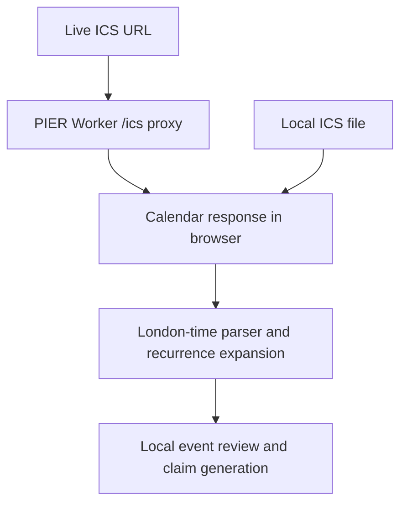

# PIER architecture

## Runtime overview

PIER is a dependency-light browser application. `index.html` and `styles.css` provide the UI; `app.js` loads ordered modules from `app-parts/`, including the beta accessibility enhancement layer in `app-06.js`. Claim/PDF rendering uses browser canvas and jsPDF. The same static bundle is built into `site-dist/` for Cloudflare Worker static assets.

| Channel | Source branch | Public frontend/API | Worker config |
|---|---|---|---|
| Production | `main` | `https://pier.bynour.uk` and live Worker routes | `cloudflare-worker/wrangler.jsonc` |
| Beta | `beta` | `https://beta.pier.bynour.uk` / beta Worker | `cloudflare-worker/wrangler.beta.jsonc` |

GitHub Pages serves the production static site from `main`. Cloudflare Workers serve APIs and the beta static asset build. Both channels require HTTPS.

## Local browser state

The primary application state is serialized to `localStorage`. It includes Setup values, calendar URL, imported and manual events, selected months, editable claims, signature image data, Expense Log, reminder preferences/identity, accessibility settings, and telemetry counters. IndexedDB stores limited service-worker reminder configuration. Browser/PWA caches hold public app-shell assets, not claim records.

Backup downloads the local state as user-controlled JSON. Restore parses a selected backup and replaces current local state. PDFs are generated files and are not included in backup.

## ICS flow

Live URLs are normalized (`webcal` to HTTPS) and posted to the configured Worker. The Worker validates/fetches the target and returns calendar text; the URL and returned rota are not intentionally written to D1. The browser may attempt a direct fetch if Worker retrieval fails. Imported files are read locally.

ICS and UI calendar interpretation use `Europe/London`, including GMT/BST conversion for UTC timestamps, floating values, recurrence, month membership, edits, and claim labels.

## Cloudflare Worker and D1

`cloudflare-worker/worker.js` provides:

- ICS proxying;
- minimal telemetry ingestion, deletion, and aggregate stats;
- opt-in push registration/state/test/status endpoints;
- deliberate bug-report submission, including optional compressed screenshots;
- dashboard authentication/operations; and
- channel-specific site-customization delivery.

D1 stores pseudonymous installation/telemetry aggregates, push-subscription delivery data, bug reports with expiry metadata, telemetry suppressions, and dashboard customization/draft/backup records. It must not store names, addresses, payroll/personal numbers, signatures, full rota data, claim rows, PDFs, or detailed individual claim histories.

Dashboard configuration can override allowed wording, links, and semantic color variables. The browser applies these overrides in both beta and production. Defaults remain in the static bundle. The protected dashboard itself is a separate static asset bundle; the Worker provides authentication and dashboard APIs only. Telemetry ordering/filtering is server-side and bulk deletion writes suppression records before removing pseudonymous installations.

## Data boundaries

| Information | Local device | Can reach PIER infrastructure |
|---|---:|---:|
| Name, address, payroll/vehicle details | Yes | No by normal operation |
| Signature, claim rows, PDFs, Expense Log detail | Yes | No by normal operation |
| Full imported rota/events | Yes | Transits Worker response path for live-link fetch; not intentionally stored |
| Private live ICS URL | Yes | Transits `/ics`; not intentionally stored |
| Random installation/device token | Yes | Yes for telemetry/push |
| Coarse usage counters, device class, channel/version, aggregate totals | Yes | Yes when telemetry enabled |
| Push endpoint/keys/preferences and coarse month state | Yes | Yes when push enabled |
| Feedback text, reviewed technical details, optional screenshot | Until submission/preparation | Yes only on deliberate submission; retained 90 days |
| Dashboard customization | Cached/applied | Yes, stored in D1 |

No secrets, dashboard credentials, API tokens, or private URLs belong in source or documentation.

## Claim and PDF flow

Claimable local events are ordered and linked where appropriate. The browser creates outbound and home-bound rows, applies mileage/additional-expense settings, and renders editable previews. Canvas rendering produces official-form-style pages; jsPDF saves selected months locally. A successful export updates local claim/export state, Expense Log, and privacy-preserving aggregate ledgers. Email payroll uses a `mailto:` draft and cannot attach files.

## PWA and service worker

`manifest.json` defines the installable identity, Sunrise Harbour theme/background, start URL, display mode, and icons. `sw.js` caches versioned public shell assets and handles push display/click behavior. Navigation/assets use network-aware cache behavior so releases can replace old shells. Push and service workers require HTTPS (localhost is allowed for development).

## Telemetry flow

The browser accumulates bounded counters and replaceable per-month amount/mileage aggregates, then posts a pseudonymous payload to `/api/telemetry`. `/api/stats` returns aggregate public figures. The privacy toggle can stop future sync and requests deletion of the installation record. Feedback uses a separate explicit `/api/bug-report` flow and is not ordinary telemetry.

## Deployment

The Cloudflare workflow is triggered independently by `beta` and `main`:

1. install locked dependencies;
2. run regression/integration checks;
3. build static assets;
4. on `beta`, deploy and verify only the beta Worker/assets;
5. on `main`, apply required D1 migrations, deploy and verify only live.

Concurrency is branch-specific. A production run must not overwrite beta. Promotion normally means fast-forwarding `main` to the exact commit verified on `beta`. Asset query versions, application version, and service-worker cache version are kept aligned (currently `61`) to prevent mixed shells.

## Security

Public operation is HTTPS-only. Worker requests validate method/origin/authorization as appropriate; dashboard operations require authentication. Proxy and feedback inputs are bounded and validated. Privacy boundaries are architectural constraints, not optional conveniences.

## Astral and mileage reconciliation

`app-parts/astral.js` loads the pinned MIT bundle from `vendor/astral/main.js` and adapts its navigation placement and keyboard semantics. The build and service-worker shell include the bundle; no runtime CDN request is needed. The widget uses browser speech synthesis for optional text-to-speech. No claim data is sent to Astral by PIER. Widget preferences are session controls, separate from PIER backups.

`mergeState` resets the approved rate to £0.30 and reconciles Expense Log monetary values from the existing saved miles and miscellaneous amounts. Journey rows and PDF files are unchanged. Shared `mileageAmount` is used for new log and aggregate calculations.
